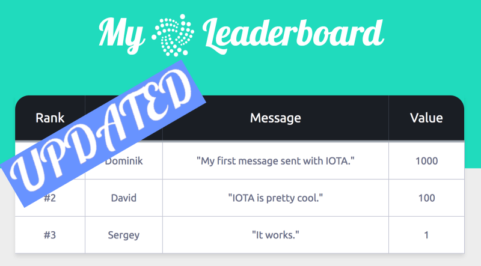

---
# IOTA Leaderboard: Micropayments and Messaging Example

This is a fork of the IOTA Proof of Concept Application example with tutorial. 

The goal is to extend the original [code/repository](https://github.com/domschiener/leaderboard-example)  and [tutorial](https://learn.iota.org/tutorial/payments-and-messaging-leaderboard) written by Dominik Schiener, co-funder of [IOTA](https://iota.readme.io/docs/what-is-iota), because you need a local [IOTA full node](https://iota.readme.io/docs/install-iri) for the original code to work correctly. 

This code utilises javascript library [curl.lib.js](https://github.com/iotaledger/curl.lib.js) to avoid delegation of PoW to a full node and instead the PoW is done locally. (PoW = Proof of Work, see the [glossary](https://iota.readme.io/docs/glossary) for more info).

You can either use the final version (main branch) or try to reproduce the solution.

---
## SECURITY WARNING
This web application needs your `secret seed`, which you should never use in an online tool, unless it's approved by [IOTA Foundation](https://iota.org/). Therefore I highly recommend to generate `a new seed` for testing purpose only and to transfer some **minimal amount of IOTA Tokens** to an address generated using such a seed.

---
## Step By Step Guide
1. Clone or download the repository localy. 
2. Open `send.html` page in your browser.
3. Open the side menu by clicking on the menu icon in the top right corner.
4. Click on the `MY SEED` menu item.
5. Paste your `secret seed` generated for `testing purpose only`.
6. Click `Submit` button.
7. Optional: Close the side menu by clicking on the `X` icon.
8. Fill the form
    * `Your Name` - Name of the send, that will be displayed in the leaderboard.
    * `Value` - The amount of IOTA Tokens to be transfered. It has be less than the balance for your seed.
    * `Recipient Address` - Your address used to receive the funds. You have to use an adress which hasn't been used for sending yet. Once an address is used for sending funds, it can't never be used again.
    * `Text Area` - Some message to be sent and to be displayed in the leaderboard.
9. Click on the `Submit` button.
10. Wait until new transaction is created, the PoW is done localy and the transfer is done. Well, it will be in the `pending` state for some time (few seconds to few minutes, depends on the net). However, you should already see that in the leaderboard.
11. Open `index.html` page in your browser.
12. Open the side menu by clicking on the menu icon in the top right corner.
13. Click on the `MY SEED` menu item.
14. Paste your `secret seed` generated for `testing purpose only`. Ideally, use the same seed as in the `step 5`.
15. Click `Submit` button.
16. Optional: Close the side menu by clicking on the `X` icon.
17. Wait couple of seconds, until data for your seed is downloaded from the provider and the leaderboard is updated.

## Describtion of changes
I will describe all the changes I did to [the original repository](https://github.com/domschiener/leaderboard-example). So that, you can try to reproduce that too.
1. Download [the original repository](https://github.com/domschiener/leaderboard-example) locally.
2. [73fb676](https://github.com/marektakac/leaderboard-example/commit/73fb676794a0fc7749ec6a5b0cd72d69e6747653) - **Formatting and semicolons** - I'm using Visual Studio Code as the editor. It reformats the code on save automatically. So I've decided to fix document formatting first, to get rid of them. I also added missing semicolons in js files.
3. [4d10a02](https://github.com/marektakac/leaderboard-example/commit/4d10a02a5b09fa88a9d93433215dd52ba1c9dd1e) - **Use a full public node as a provider** - I changed the provider from the local full node to a random public full node.
4. [61bfa53](https://github.com/marektakac/leaderboard-example/commit/61bfa530ecc0b39c9e162073858c83f775f4ee91) - **Update iota.lib.js** - I had to update the iota.lib.js javascript library to the latest version, which was v0.4.7 at the moment.
5. [9181046](https://github.com/marektakac/leaderboard-example/commit/918104646066e8224cb0bf5c992709d17c898074) - **Use curl.lib.js for local PoW** - And finally the most important step. We have to use the library [curl.lib.js](https://github.com/iotaledger/curl.lib.js) to avoid delegation of PoW to a full node and instead the PoW is done locally.
    * Get the library - as the [library project](https://github.com/iotaledger/curl.lib.js) doesn't include the compiled version of the libarary, so we have to compile it:
    	* Clone [project](https://github.com/iotaledger/curl.lib.js) locally
	    * Run the following scripts:
    		* `npm install`
	    	* `npm run build`
    	* Copy `curl.lib.js/dist/curl.min.js` to `leaderboard-example/js/curl.min.js`
    * Include the library in send.html
    * Use `curl` to override `AttachToTangle()` function in `js/send.js`, so that the PoW is done locally.
    * Increase the `minWeightMagnitude` from `9` (used in testnet) to `14` (used in mainnet).

And that's it. You have a web app, that can create IOTA transactions (with value and message) while the PoW is done locally in your browser using GPU (if it's supperted by your browser). The message can afterwards be displayed in the leaderboard.